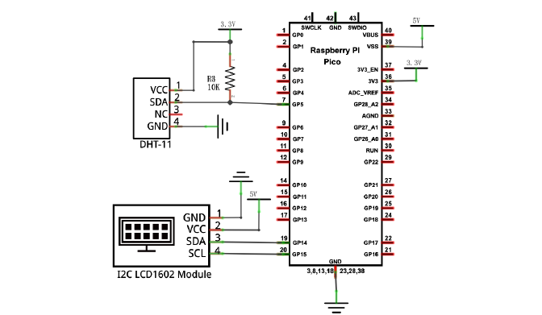
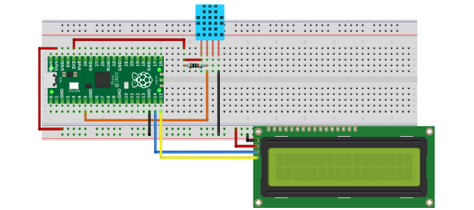
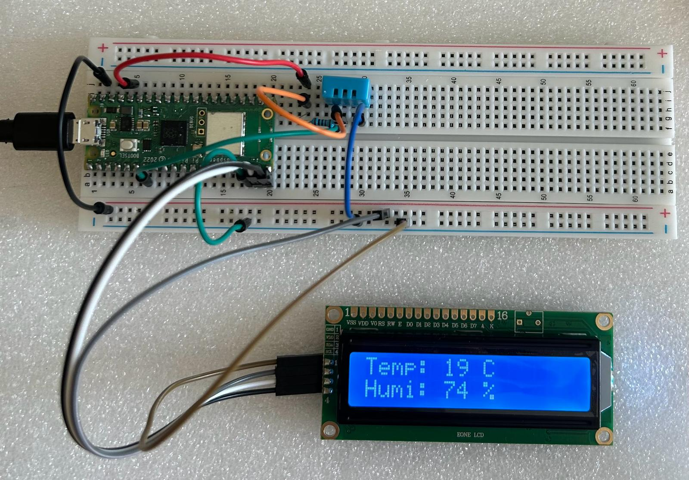

# Hygrothermograph

Raspberry Pi Pico W based project designed to monitor and display temperature and humidity levels using a DHT11 or similar sensor and an LCD screen. This project offers an affordable and DIY solution for tracking environmental conditions in homes, offices, or other spaces.

## Diagram

## Circuit

## Hygrothermograph

